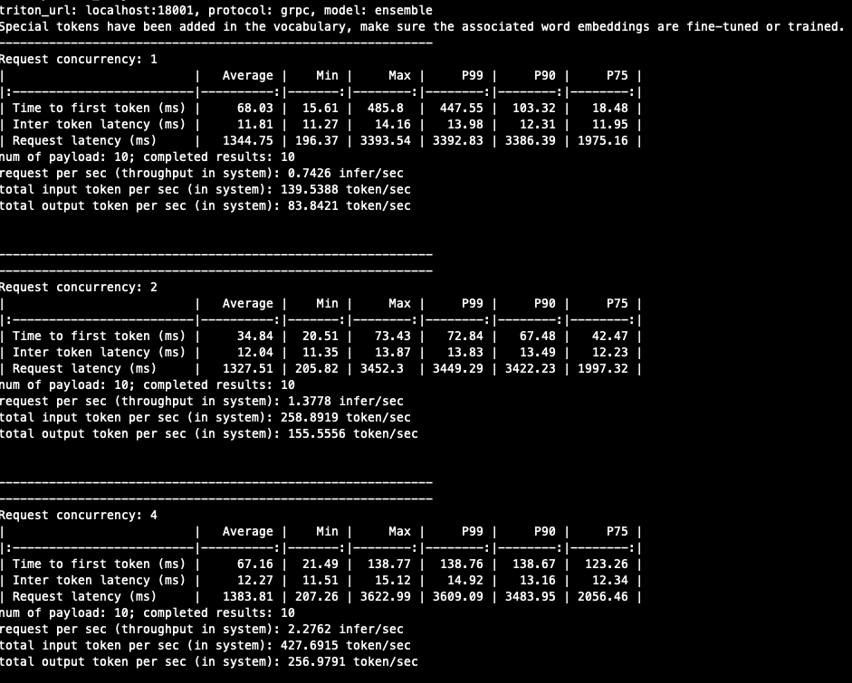
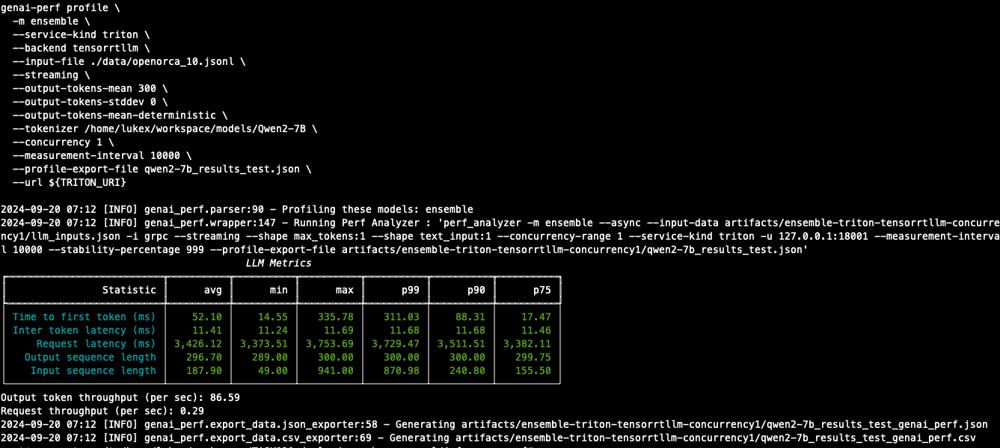

# 测试TensorRT-LLM及其Triton下的LLM推理业务性能

## 1.用户需求

当用户使用或希望评测 TensorRT-LLM和Triton Inference Server 作为 LLM 推理平台，通常在评估推理性能时有以下的需求

* 使用真实的模型权重，在公开和私有的业务数据集上评测 GPU 和推理软件的性能
* 能做端到端的，和实际推理业务一致的测试（推理流程包括了Triton model ensemble 中的子模块）
* 能收集全面的指标信息；由于第三方的 API 通常对Input token 和 Output token 区别定价，用户偏好能有区分 Input vs Output token的吞吐指标
* 评测推理速度（延迟和吞吐）的同时，能收集LLM 返回的答案，来评估 LLM 的准确率（不用重复测试）
* 部分用户的输入 token 中提示词模板重复，或多次测试性能受到kv cache 功能影响，希望能测试的时候能临时禁用 kvcache

用户在上述性能评测中，常见的一些痛点和 gap:

* 对于初次评测的用户来说，当前的TensorRT-LLM和Triton Backend的部署（模型的下载，量化，校准，TensorRT引擎编译）和设置等步骤比较多，手动配置比较繁琐
* Triton中的 `perf_analyzer` 只适用于通用的推理测试，指标信息不全面，并且无法统计 以token 为单位的吞吐
* Triton的`GenAI-Perf`是在`perf_analyzer`基础上构建的，接近用户需求；该工具调用`perf_analyzer`指定了输出的 token 数量或范围


## 2. 评测LLM推理业务性能的步骤

#### 1.编译容器

- 先根据 https://github.com/triton-inference-server/tensorrtllm_backend?tab=readme-ov-file#option-2-build-via-docker tensorrtllm_backend 中的步骤构建容器，以 TAG v0.11.0为例，把容器镜像命名为 `nvcr.io/nvidian/sae/customer_triton_trt_llm:v0.11.0`

- 使用 `Dockerfile.trtllm_v0.11.0`，基于 `nvcr.io/nvidian/sae/customer_triton_trt_llm:v0.11.0`构建容器，把相关的代码和脚本打包到容器中方便后续使用: `docker build -t triton_trt_llm:v0.11.0 -f Dockerfile.trtllm_v0.11.0 . `

以下实验在 `triton_trt_llm:v0.11.0` 容器内完成。

#### 2. 用自动化工具完成部署

使用本文附件中的自动化的脚本，在容器中完成模型的下载，量化，校准，TensorRT引擎编译，Triton的部署。本文以 Qwen2 为例。

**编辑配置**

根据实验需要，编辑 `inference_deploy/deploy_qwen.sh` 中的配置，例如最大 input/output tokens, 量化的方式等。

```bash
(...skip...)

# example, batch_size_list="1 4 8 16 32 64 128 256"
batch_size_list="4 8"

#input_len_output_len_list="128,2048 2048,128 2048,2048, 8192,4096"
input_len_output_len_list="2048,1024"
# tesorrt-llm triton backend's decoupled_mode
triton_streaming_mode=True

function set_param_model_qwen2_7b {
    model_family="qwen"
    hf_name="Qwen/Qwen2-7B"
    hf_model_dir_base="Qwen2-7B"
    num_gpus=1
    pp_size=1
    tp_size=$(( num_gpus / pp_size ))
}

(...skip...)

for model_size in  qwen2_7b qwen2_72b qwen2_72b_tp4pp2 qwen2_72b_tp8pp1; do
    for precision in fp8 fp16 int8_wo; do
      ...

```

说明:

- batch_size_list: TensorRT engine max_batch_size的列表; 也是Triton中 dynamic_batching配置中的 triton_max_batch_size
- input_len_output_len_list: input seqence length和 output seqence length组合的列表
- triton_streaming_mode: tesorrt-llm triton backend的 decoupled_mode, True为streaming模式
- 根据实验需要，修改 model_size 和 precision的循环列表。可选的列表需要有对应的 `set_param_model_`函数， `set_param_quant_`函数

**运行自动化脚本**

- 如果对应的Huggingface LLM模型没有下载到本地文件夹，首先设置HF_TOKEN环境变量: `export HF_TOKEN=<YOUR_HF_TOKEN>`
- 运行 `/opt/inference_deploy/deploy_qwen.sh` 来执行模型的下载，量化，校准，TensorRT引擎编译，Triton配置文件的设置的步骤

**运行Triton Server**

示例:

```bash
python3 /opt/scripts/launch_triton_server.py  \
    --model_repo=/workspace/ensemble_models/qwen2_7b_fp8_tp1_pp1_isl2048_osl1024_bs8 \
    --world_size 1 --grpc_port 18001 --http_port 18000
```

#### 3. 准备测试数据

将你的提示数据准备在一个 "jsonl"文件中，每行包含一个"text_input"键：

```
{"text_input": "prompt 1..."}
{"text_input": "prompt 2..."}
...
```

#### 4. 使用 `llm_perf.py`测试性能

如果用户希望 LLM根据返回的EOS token时终止生出，即是不超过最大 output token时，output token数量是LLM决定的，可以使用本文附件中的`llm_perf.py`脚本测试性能。
此外，用户可以修改 `llm_perf.py` 以适配自己的测试需求。

命令使用的例子:

```bash
python3 llm_perf.py \
        -u localhost:18001 -i grpc -m ensemble \
        --concurrency 2,4,8,16 \
        --tokenizer-path /models/Qwen2-7B \
        --input-data ./data/openorca_10.jsonl
```

命令行参数说明:

```bash
-u <URL for inference service>
-i <Protocol used to communicate with inference service>, "http" or "grpc"
-m: This is a required argument and is used to specify the triton model name against which to run
--concurrency a list of concurrency on client side, e.g. "1,4,8"
--input-data <<file path>>
--profile-export-file <<file path>>
```

测试结果示例




说明:

* 此处的参数指标定义，请参见 https://docs.nvidia.com/nim/benchmarking/llm/latest/metrics.html


#### 5. 使用Triton的`GenAI-Perf`测试性能

Triton的`GenAI-Perf`工具也可以用来测试部署在Triton服务器上的LLM推理性能。
如果用户希望 LLM 输出的 token 数量是由测试工具的配置参数可控的数值，或某一个分布范围，可以使用`GenAI-Perf`执行测试。

具体步骤

* 下载并运行容器镜像: `nvcr.io/nvidia/tritonserver:24.08-py3-sdk`
* genai-perf可以使用不同的数据来源作为测试数据，自动生成的伪数据，huggingface 的数据集，以及用户指定的json 文件作为提示词测试数据。
* 以下使用指定的jsonl 文件为例子，同样，jsonl文件每行包含一个"input_text"键，genai-perf会把文件转换为临时文件，如 `artifacts/ensemble-triton-tensorrtllm-concurrency1/llm_inputs.json`, 再调用Triton中的 `perf_analyzer`发送推理请求

```bash

export TRITON_URI=127.0.0.1:18001

genai-perf profile \
  -m ensemble \
  --service-kind triton \
  --backend tensorrtllm \
  --input-file ./data/openorca_10.jsonl \
  --streaming \
  --output-tokens-mean 300 \
  --output-tokens-stddev 0 \
  --output-tokens-mean-deterministic \
  --tokenizer /workspace/models/Qwen2-7B \
  --concurrency 1 \
  --measurement-interval 10000 \
  --profile-export-file qwen2-7b_results_test.json \
  --url ${TRITON_URI}
```

测试结果示例



说明: `genai-perf` 通过 `--output-tokens-mean` `--output-tokens-stddev` 参数指定的输出 token 的数量和分布。


## 3. 常见问题


**以下这些性能指标的定义和计算方式是什么？**

Time to first token (ms)
Inter token latency (ms)
Request latency (ms)
Output sequence length
Input sequence length
Output token throughput (per sec)
Request throughput (per sec)

请参见：https://docs.nvidia.com/nim/benchmarking/llm/latest/metrics.html


**用户希望在测试中看到GPU 本身的计算性能。在测试提示词数据中，不同请求中文本有高百分比的重叠，例如使用了同样的提示词模板，由于有 kvcache的功能，无法反应GPU本身的性能。如何能测试临时禁用 kvcache？**

对于具有较长系统提示词，或提示词模板，所有请求可以复用kvcache 中缓存的input tokens，而不需要重新计算，从而降低TTFT的耗时。
测试时如果想禁用kvcache，可以编辑 Trtion ensemble models 目录中的 `tensorrt_llm/config.pbtxt`，把`enable_kv_cache_reuse` 设置为 False


**`genai-perf` 和 `llm_perf.py`测试结果中，Inter token latency相似，但是Request latency和Request throughput差别比较大，为什么？**

主要因为两种测试方式的output token数量不同。

* `genai-perf` 通过 `--output-tokens-mean` `--output-tokens-stddev` 参数指定的输出 token 的数量和分布。
* `llm_perf.py`: LLM返回的 EOS决定了 output token 的长度